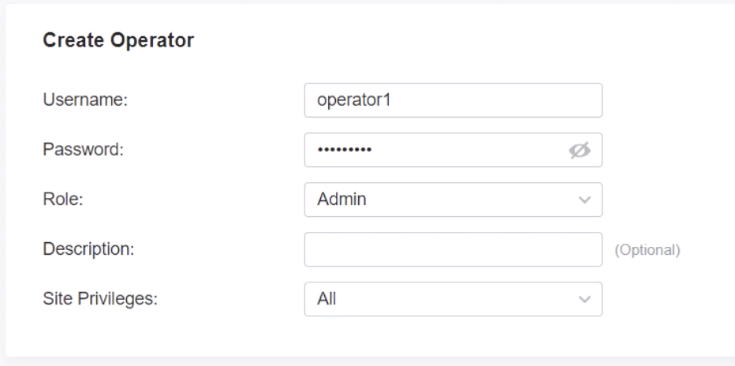
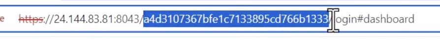

This is a [Next.js](https://nextjs.org) project bootstrapped with [`create-next-app`](https://nextjs.org/docs/app/api-reference/cli/create-next-app).

## Getting Started

1. install docker and docker-compose
2. on your rasberry pi open up a terminal and create a new project omada-controller
```
mkdir omada-controller
cd omada-controller
```
3. create a docker-compose file with the following content
```
Confirm Omada is Listening on Port 8088
In your docker-compose.yml, you should have something like:

yaml
Copy
Edit
services:
  omada-controller:
    image: mbentley/omada-controller:latest
    ports:
      - "8088:8088"  # Guest auth port (NEEDED for captive portal)
      - "8043:8043"  # Admin web interface (optional)
      - "27001:27001/udp"
      - "29810:29810/udp"
      - "29811:29811"
      - "29812:29812"
      - "29813:29813"
    volumes:
      - omada-data:/opt/tplink/EAPController/data
      - omada-logs:/opt/tplink/EAPController/logs
      - omada-work:/opt/tplink/EAPController/work
    restart: unless-stopped
```
4. connect the rasberry pi to your main mada switch which should be connected to your omada router.
5. run `docker-compose up`
6. open up a browser window into `192.0.12.3`
7. set up the oamda software controller and login

## Make Sure the Controller is Running in Online Mode

8. create a new guest network
9. set up the guest network
```
Step-by-step in Omada Controller UI:
Login to your Omada Controller

Go to: Settings > Authentication > Portal

Click Create New Portal

✅ Portal Settings
Field	Value
Portal Name	Custom WiFi Portal
Authentication Type	External Portal Server
Portal Customization	Disabled
External Portal URL	https://wifi.yourdomain.com/portal (must match your deployed app)
Portal Protocol	HTTPS
Portal Server Shared Secret	<your secret key>
Landing Page	(Optional redirect URL after successful login)
✅ Apply the portal to your Wi-Fi SSID
Go to Settings > Wireless Networks

Select your guest SSID (e.g., FreeStoreWiFi)

Enable Portal Authentication

Select your new Custom Portal from the dropdown
```
11. update the OMADA_PORTAL_SECRET env variable
10. get your rasberry pis IP with `hostanem -I`


11. Set up port forwarding on your omada router
```
Field	What to Enter
Name	Omada guest auth (you already did this ✅)
Status	✅ Enabled (good)
Source IP	Any (default is fine — allows from all guests)
Interface	Select your WAN interface (e.g., WAN1 or whatever your internet uses)
WAN IP	Leave blank unless your router has multiple WAN IPs (optional)
DMZ	❌ Leave disabled
Source Port	Leave blank or enter 8088
Destination IP	IP address of your Raspberry Pi (e.g., 192.168.0.100)
Destination Port	8088
Protocol	Select TCP (this is the protocol used for the /portal/auth redirect)
```

12. find your public ip: Go to https://whatismyipaddress.com

13. update your env `OMADA_CONTROLLER_URL=http://<your public ip>:8088/portal/auth`


-----------------------------

# Complete Omada TP link Netwrok setup for a retail store

In this tutorial we will go through a complete setup of how to connect and set up a TP link Omada network for a department store or other large facility.

Have you seen how sometimes when you are at an airport you get a small pop up saying that there is a free wifi network available, and then when you try to join the given network, it takes you to a small browser window that asks you for some information like your email, or contains a payment form?

this is called a guest portal, and at the end of this tutorial we will have a netwrok with a guest portal that you can use to get infromation from users joining your wifi network, charge for wifi access with a payment form, and more.

the omada guest portal in this repository is built with next js to be hosted on vercel, and it collects user data in a dynamodb table, making it cheap,flexible and scalable.

it has a docker-compose template to test functionality in development and also contains a terraform template to deploy propduction resources with ease.

# What you will need
1. Omada compatible router
2. Omada compatible switch
3. Omada access points
4. A Rasberry Pi 4 or above (or a comparable windows or linux machine that you can leave running as a server) with a keyboard, mouse and monitor

# Connect everything
we will be connecting all devices with Cat6 internet cables and using PoE to powewr our APs.


# Setup the rasberry pi
1. Turn on your rasberry pi and pull up a new terminal window

2. **set up SSH on your rasberry pi**

2. install docker and docker-compose
3. **add a restart policy on the container** `restart: unless-stopped`
4. enable docker to start on reboot `sudo systemctl enable docker`

3. create a directory called omada-controller 
```
cd Desktop 
mkdir omada-controller
```
4. create a docker-compose.yml file with the content bellow and save it.

```
Version: "3.1"

services:
  omada-controller:
    container_name: omada-controller
    image: mbentley/omada-controller:5.14
    ulimits:
      nofile:
        soft: 4096
        hard: 8192
    stop_grace_period: 60s
    network_mode: host
    environment:
      - PUID=508
      - PGID=508
      - MANAGE_HTTP_PORT=8088
      - MANAGE_HTTPS_PORT=8043
      - PORTAL_HTTP_PORT=8088
      - PORTAL_HTTPS_PORT=8843
      - PORT_APP_DISCOVERY=27001
      - PORT_ADOPT_V1=29812
      - PORT_UPGRADE_V1=29813
      - PORT_MANAGER_V1=29811
      - PORT_MANAGER_V2=29814
      - PORT_DISCOVERY=29810
      - PORT_TRANSFER_V2=29815
      - PORT_RTTY=29816
      - SHOW_SERVER_LOGS=true
      - SHOW_MONGODB_LOGS=false
      - SSL_CERT_NAME=tls.crt
      - SSL_KEY_NAME=tls.key
      - TZ=Etc/UTC
    volumes:
      - ./omada-data:/opt/tplink/EAPController/data
      - ./omada-logs:/opt/tplink/EAPController/logs
    restart: unless-stopped
  ddclient:
    image: linuxserver/ddclient
    container_name: ddclient
    restart: unless-stopped
    network_mode: host
    environment:
      - TZ=America/Panama
    volumes:
      - ./ddclient.conf:/config/ddclient.conf
```

5. create a directory on the root `cloudflared` inside cloudflared, create 2 files:
- config.yml
- omada-tunnel.json

6. create a `ddclient.conf` file with the follwoing content
```
# ./ddclient.conf
protocol=namecheap
use=web, web=dynamicdns.park-your-domain.com/getip
server=dynamicdns.park-your-domain.com
login=yourdomain.com
password='your-ddns-password'
portal
```

5. Run `docker-compose up`

## Create an SSL certificate
use lets encrypt

add PEM certificate into omada settings

Check logs:

docker logs ddclient
You should see something like:

vbnet

SUCCESS:  portal.yourdomain.com -- Updated to 123.45.67.89


# Set up the Omada network

## Initial Setup
1. On your rasberry pi, open up a new browser window and go into `localhost:8043`
2. create username and password etc
3. create a new site
4. go to devices, and adopt all rechable devices


## Make sure that the IP of the omada controller doesnt clash with other IPs (modem, raspi)

change the main WAN IP address, it should be set by default to `192.168.0.1` you can change it to something like `192.168.10.1`

## Enable bridge mode on your modem

In my case i have an Arris TG2482A modem router and to put it in bridge mode i had to call my ISP and request this change. otherwise you can log in to your modem's admin panel, for arris modems usually `192.168.0.1:8080` login with username and password (by default the username is admin and the password is the pre-shared key on your device) and access the settings which should have a router mode or bridge mode option. In case this option is not displayed contact your ISP and request they change your modems configuration to bridge mode


## Make the rasberry PI publicly accesible

### Fix your rasberry PIs IP
In the Omada software controller, navigate to the clients menu and click on your raspberrypi or PC running the software controller, then on the right panel, click on config and check the box for `Use Fixed IP Address` for the netwrok use your default network and for IP adress you can use `192.168.10.4` or some IP that wont clash with other devices. then click apply.


1. Run this in your Raspberry Pi terminal `ip link`
You’ll see output like this:

```
2: eth0: ...
    link/ether **b8:27:eb:aa:bb:cc** brd ff:ff:ff:ff:ff:ff
3: wlan0: ...
    link/ether **dc:a6:32:dd:ee:ff** brd ff:ff:ff:ff:ff:ff
```

2. Copy the MAC address for wlan0 (the wired connection), in this case `dc:a6:32:dd:ee:ff`
3. On the omada controller, Go to: `Settings > LAN > DHCP Server > Address Reservation`
4. Get the local IP of your rasberry Pi `hostname -I`
5. Add a reservation
```
MAC: dc:a6:32:dd:ee:ff

Reserved IP: e.g., 192.168.0.150
```


### Set up port forwarding rules

1. On the omada software controller, navigate to `Transmission > NAT > Virtual Servers` and click “+ Add” (or "Create New Rule")
2. Add Forwarding rules:

| Name               | External Port   | Internal IP     | Internal Port   | Protocol  | Description                      |
|--------------------|-----------------|------------------|------------------|-----------|----------------------------------|
| Omada HTTPS        | 8043            | 192.168.0.150    | 8043             | TCP       | Secure Web Access                |
| Omada HTTP         | 8088            | 192.168.0.150    | 8088             | TCP       | Insecure Web Access (optional)   |
| Omada Device Mgmt  | 29810–29814     | 192.168.0.150    | 29810–29814      | TCP/UDP   | AP/switch communication          |
| Controller Disc.   | 27001           | 192.168.0.150    | 27001            | UDP       | Discovery                        |
| Controller Mgmt    | 27002           | 192.168.0.150    | 27002            | UDP       | Manager connection               |

### Add dynamic DNS

1. Go to your domain name provider, in this case namecheap, and search for your domain name and advanced DNS settings
2. 


1. On the omada software controller, navigate to `Settings > Services > Dynamic DNS` and click + Create New Dyanmic DNS Entry
2. For service provider select NO-IP


### Add Protection
- Use only HTTPS (8043), not HTTP (8088)
- Change the default Omada login
- Set up UFW on the Pi:
```
sudo ufw allow 8043/tcp
sudo ufw enable
```

## Create a Wireless Network


## Create a Portal


## Cerate an Operator
1. On the omada software controller, click on organization on the top right corner and click on Hotspot manager
2. Navigate to `Operator` and create a new operator, feel free to select any username and password but save these as youll need them later.



## get the id of your controller


# Deploy your customer portal

Now you are ready to customize and deploy your guest portal,

1. fork and clone the github repo
2. add env variables in .env
```
PROJECT_NAME=mansa-wifi-portal
PROJECT_REPO=gkpty/omada-guest-portal

AWS_ACCESS_KEY_ID=XXXXXXXXXXXXXXXXXXX
AWS_SECRET_ACCESS_KEY=XXXXXXXXXXXXXXXXXXX
AWS_REGION=us-east-1
AWS_DEFAULT_REGION=us-east-1

VERCEL_API_TOKEN=XXXXXXXXXXXXXXXXXXX
VERCEL_TEAM_ID=team_XXXXXXXXXXXXXXXXXXX

OMADA_CONTROLLER_URL=https://yourcustomname.tplinkdns.com:8043
OMADA_OPERATOR_USER=mansaoperator
OMADA_OPERATOR_PASS=XXXXXXXXXXXXXXXXXXX
```
- use the aws credetianls for a super user or a user that has access to dynamoDB and IAM
- obtain vercel api token and team id from vercel

3. test locally `npm run dev`
4. customize: feel free to add additional for fields, modify the backend logic, etc.
5. deploy by running `./deploy.sh`


## Add an SSL certificate


